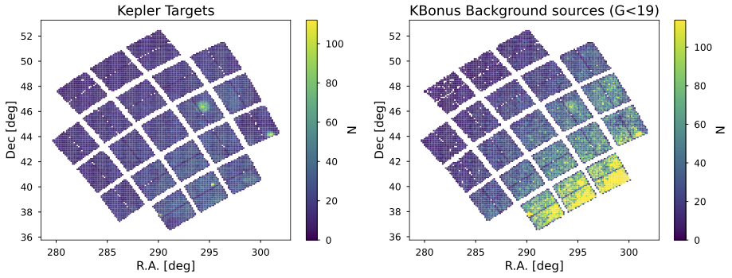

# KBonus

This repository contain notebook examples for how to read  Kepler Bonus light curve files
and how to use the [PSFMachine](https://github.com/SSDataLab/psfmachine)
and its API to reproduce the light curve products
presented in [Martinez-Palomera et al. 2023](https://ui.adsabs.harvard.edu/abs/2023arXiv231017733M/abstract)
and published in [MAST](https://archive.stsci.edu/hlsp/kbonus-bkg) archive.

The presented light curve catalog contains more than 600,000 sources extracted from
Kepler's first mission data.
These light curves have PSF and aperture photometry as well as multiple extraction metrics
useful to asses their quality.
This shows the Kepler field and the distribution of detected sources:

The left panel shows the distribution of mission selected targets (>200k) for which the
Kepler pipeline extracted light curves.
The right panel shows background sources (>400k) for which this work created new light curves.

Here you will find two example notebooks:

1. [tpf_stack_run.ipynb](https://github.com/jorgemarpa/KBonus/blob/main/notebooks/tpf_stack_run.ipynb)
How to use `psfmachine` API to extract light curves as in Martinez-Palomera et al. 2023
2. [light_curve_example.ipynb](https://github.com/jorgemarpa/KBonus/blob/main/notebooks/light_curve_example.ipynb)
How to read the FITS files using `lightkurve` library.
3. [kepler_686_example.ipynb](https://github.com/jorgemarpa/KBonus/blob/main/notebooks/kepler_686_example.ipynb)
Loading Kepler 686 light curve and comparing with Kepler pipeline.
3. [light_curve_caveats.ipynb](https://github.com/jorgemarpa/KBonus/blob/main/notebooks/light_curve_caveats.ipynb)
A few caveats examples of the light curves.
