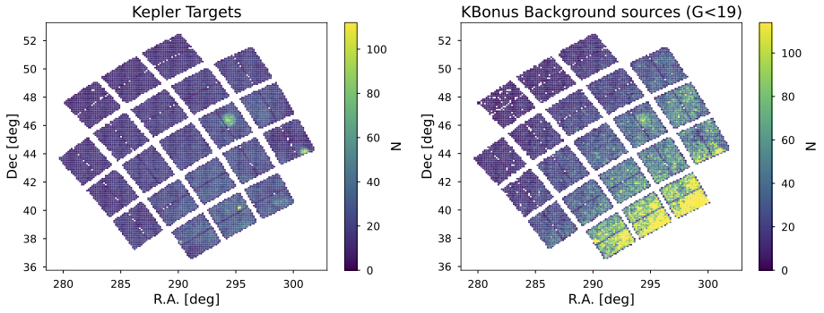
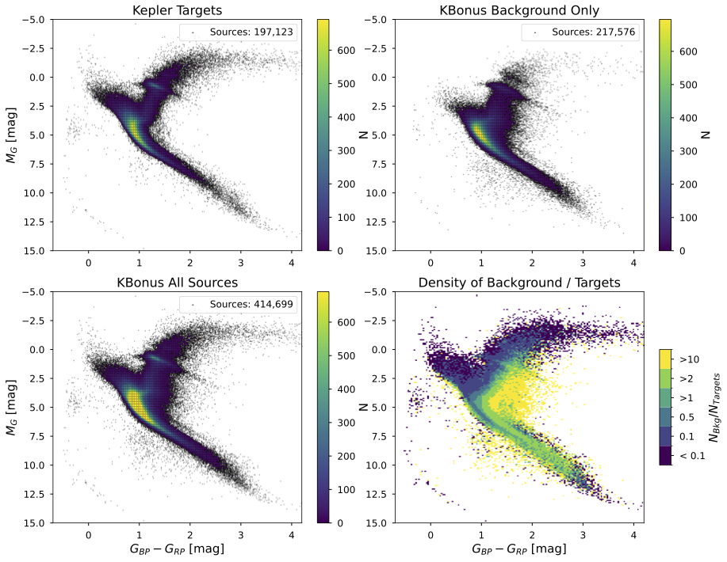
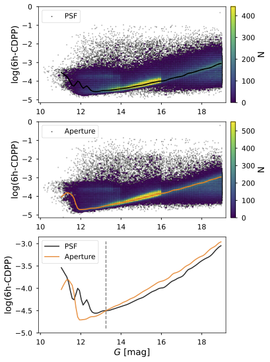

README file for KBonus-BKG: Kepler Background PSF light curves
MAST webpage: https://archive.stsci.edu/hlsp/kbonus-bkg/
Refer to this HLSP with DOI: https://dx.doi.org/10.17909/7jbr-w430

README
===================

Contributor
-----------
* Jorge Martinez-Palomera  [BAERI/NASA Ames] (palomera@baeri.org)
* Christina Hedges         [BAERI/NASA Ames]

General Information
-------------------
NASA's *Kepler* primary mission observed about 116 deg2 in the sky for 3.5 consecutive years to discover Earth-like exoplanets.
This mission recorded pixel cutouts, known as Target Pixel Files (TPFs), of over $200,000$ targets selected to maximize the scientific yield.
The Kepler pipeline performed aperture photometry for these primary targets to create light curves.
However, hundreds of thousands of background sources were recorded in the TPFs and have never been systematically analyzed.
This work uses the Linearized Field Deblending (LFD) method, a Point Spread Function (PSF) photometry algorithm, to extract light curves.
We use Gaia DR3 as input catalog to extract 606,900 light curves from long-cadence TPFs.
406,548 are new light curves of background sources, while the rest are Kepler's targets.
These light curves have comparable quality as those computed by the Kepler pipeline, with CDPP values $<100$ ppm for sources $G<16$.
The light curve files are available as high-level science products at MAST.
Files include PSF and aperture photometry, and extraction metrics.
Additionally, we improve the background and PSF modeling in the LFD method.
This new nearly unbiased catalog enables further studies in planet search, occurrence rates, and other time-domain studies.

A full description of this dataset can be found in Martinez-Palomera et al. 2023 [2], as well as the Python library [`psfmachine`](https://github.com/SSDataLab/psfmachine) that was used to extract the light curves. An example of the parameter configuration and how `psfmachine` was used can be found in the GitHub repository [`KBonus`](https://github.com/jorgemarpa/KBonus).

What is Being Released
----------------------
This is the v1.0 release of source light curves observed in Kepler's TPFs:

* 606,900 PSF light curve files in FITS format. Each file contain concatenated time series all detectable quarters (primary extension), and multiple extensions with the per-quarter light curves.

* **hlsp_kbonus-bkg_kepler_kepler_source-catalog_kepler_v1.0_cat.fits**: a FITS catalog containing the 606,900 Gaia DR3 objects with G<19 observed in the TPFs.

* **hlsp_kbonus-bkg_kepler_kepler_kois-nns-catalog_kepler_v1.0_cat.fits**: a FITS catalog containing the Kepler Object of Interest (KOIs) and all the neibors around each KOI within 30 arcseconds.

* **hlsp_kbonus-bkg_kepler_kois-nns_v1.0_lcf.tar.gz**: tarball files with all light curve files listed in the KOIs and neighbors catalog.

* **hlsp_kbonus-bkg_kepler_kepler_mstars-catalog_kepler_v1.0_cat.fits**: a FITS catalog containing the M-stars as described in [2].

* **hlsp_kbonus-bkg_kepler_mstars_v1.0_lcf.tar.gz**: tarball files with all light curve files listed in the M-dwarf catalog.

* **hlsp_kbonus-bkg_kepler_kepler_wd-catalog_kepler_v1.0_cat.fits**: a FITS catalog containing the white dwarfs.

* **hlsp_kbonus-bkg_kepler_wd_v1.0_lcf.tar.gz**: tarball files with all light curve files listed in the white dwarf catalog.

* this "README" file

The light curve files have names of the form:

    hlsp kbonus-bkg_kepler_kepler_<source_id>_kepler_v1.0_lc.fits

where `<source_id>` is the KIC value of the object or the Gaia DR3 source id when no KIC is available.

How the Catalogs Were Prepared
------------------------------
The KBonus-BKG uses *Kepler*'s TPFs from all 17 observation quarters. The TPFs are available at MAST archive and correspond to small cutouts (typically 5x5 pixels) around the selected *Kepler* targets.
This HLSP uses Gaia DR3 as input catalog to compile a catalog of 606,900 light curves. 406,548 correspond to **new** background sources. The rest are *Kepler* targets.
A sky map of the observed sources is shown here:

The color magnitude diagram of *Kepler* targets and new background sources follows:

Object Detection and Photometry
-------------------------------
We used the Gaia DR3 catalog [4] as input to detect sources down to 19th magnitude in the G band.
We perform PSF photometry using the Linearized Field Deblending method (LFD) [4] to compute PSF models from *Kepler*'s FFIs and evaluate it in the TPFs.
This method includes background modeling, mean PSF photometry and corrected PSF photometry. The latter accounts for velocity aberration effects and other instrument systematics.
The LFD method is implemented in the Python package *psfmachine*

The CDPP values as a function of source magnitude:

Column Description for the Catalog and Light Curve Files
-----------------------------------

Description of the columns available in the LIGHTCURVE STITCHED extension:

| Col | Field             | Format  | Units         | Description                                             |
|-----|-------------------|---------|---------------|---------------------------------------------------------|
| 1   | Time              | float64 | BJD - 2454833 | Time value in BKJD                                      |
| 2   | Cadenceno         | int32   | -             | Cadence number                                          |
| 3   | Quarter           | int32   | -             | Qurter number                                           |
| 4   | Flux              | float64 | e-/s          | PSF flux from stitched quarters                         |
| 5   | Flux_err          | float64 | e-/s          | PSF flux error from stitched quarters                   |
| 6   | SAP_flux          | float64 | e-/s          | SAP flux from stitched quarters                         |
| 7   | SAP_flux_err      | float64 | e-/s          | SAP flux error from stitched quarters                   |
| 8   | PSF_flat_flux     | float64 | e-/s          | PSF flux from stitched quarters after flattening        |
| 9   | PSF_flat_flux_err | float64 | e-/s          | PSF flux error from stitched quarters after flattening  |
| 10  | SAP_quality       | int32   | -             | Quality flag from the TPF                               |
| 11  | Flatten_mask      | int32   | -             | Quality flag from the flattening process                |

Description of the columns available in the LIGHTCURVE Q extensions:

| Col | Field             | Format  | Units         | Description                                           |
|-----|-------------------|---------|---------------|-------------------------------------------------------|
| 1   | Cadenceno         | int32   | -             | Cadence number                                        |
| 2   | Time              | float64 | BJD - 2454833 | Time value in BKJD                                    |
| 3   | Flux              | float64 | e-/s          | Corrected PSF flux                                    |
| 4   | Flux_err          | float64 | e-/s          | Corrected PSF flux error                              |
| 5   | SAP_Flux          | float64 | e-/s          | SAP flux                                              |
| 6   | SAP_Flux_err      | float64 | e-/s          | SAP flux error                                        |
| 7   | Centroid_Column   | float64 | pix           | Centroid column value                                 |
| 8   | Centroid_Row      | float64 | pix           | Centroid row value                                    |
| 9   | SAP_quality       | int32   | -             | Quality flag from the TPF                             |
| 10  | SAP_BKG           | float64 | e-/s          | SAP background flux                                   |
| 11  | Red_chi2          | float64 | -             | Reduced chi-squared value between PSF model and data  |
| 12  | PSF_flux_nova     | float64 | e-/s          | Mean PSF flux                                         |
| 13  | PSF_flux_err_nova | float64 | e-/s          | Mean PSF flux error                                   |

The main source catalog has the following fields:

|Col | Field             | Format  | Units   | Description                                       |
|----|-------------------|---------|---------|---------------------------------------------------|
| 1  | gaia_designation  | String  | -       | Gaia designation number                           |
| 2  | ra                | Float32 | deg     | Right Ascension                                   |
| 3  | dec               | Float32 | deg     | Declination                                       |
| 4  | sap_mean_flux     | Float32 | e-/s    | Mean of SAP flux                                  |
| 5  | sap_mean_flux_err | Float32 | e-/s    | Mean of SAP flux error                            |      
| 6  | psf_mean_flux     | Float32 | e-/s    | Mean of PSF flux                                  |
| 7  | psf_mean_flux_err | Float32 | e-/s    | Mean of PSF flux error                            |
| 8  | flfrcsap          | Float32 | -       | Minimum detected SAP flux fraction                |
| 9  | crowdsap          | Float32 | -       | Minimum detected SAP crowding                     |
| 10 | npixsap           | Float32 | -       | Minimum detected SAP number of pixels             |
| 11 | psffrac           | Float32 | -       | Minimum detected PSF fraction                     |
| 12 | pertrati          | Float32 | -       | Mean detected perturbed/mean PSF ratio            |
| 13 | pertstd           | Float32 | -       | Minimum detected perturbed PSF standard deviation |
| 14 | psf_avail         | String  | -       | String encoding PSF flux availability per quarter |
| 15 | sap_avail         | String  | -       | String encoding SAP flux availability per quarter |
| 16 | psf_fraction_flag | String  | -       | String encoding PSF fraction quality per quarter  |
| 17 | phot_g_mean_mag   | Float32 | mag     | Gaia G band mean magnitude                        |
| 18 | phot_bp_mean_mag  | Float32 | mag     | Gaia BP band mean magnitude                       |
| 19 | phot_rp_mean_mag  | Float32 | mag     | Gaia RP band mean magnitude                       |
| 20 | tpf_org           | Int32   | -       | TPF where sources was detected                    |
| 21 | kic               | Int32   | -       | Kepler input catalog number                       |
| 22 | kic_sep           | Float32 | arcsec  | Distance between KIC and Gaia DR3                 |
| 23 | kepmag            | Float32 | mag     | Kepler magnitude                                  |
| 24 | file_name         | String  | -       | FITS file name                                    |

The KOIs and neighbors catalog has the following columns:

|Col | Field             | Format  | Units   | Description                 |
|----|-------------------|---------|---------|-----------------------------|
| 1  | gaia_designation  | String  | -	     | Gaia designation number     |
| 2  | ra                | Float32 | deg     | Right Ascension             |
| 3  | dec               | Float32 | deg     | Declination                 |
| 4  | kic               | Int32   | -       | Kepler input catalog number |
| 5  | fname             | String  | -       | Light curve FITS file name  |
| 6  | nn_koi            | Int32   | -       | Nearest KOI                 |
| 7  | nn_dist           | Float32 | arcsec	 | Distance to nearest KOI     |

The M-stars catalog has the following columns:

|Col | Field             | Format  | Units   | Description                 |
|----|-------------------|---------|---------|-----------------------------|
| 1  | gaia_designation  | String  | -	     | Gaia designation number     |
| 2  | ra                | Float32 | deg     | Right Ascension             |
| 3  | dec               | Float32 | deg     | Declination                 |
| 4  | kic               | Int32   | -       | Kepler input catalog number |
| 5  | fname             | String  | -       | Light curve FITS file name  |

The white dwarfs catalog has the following columns:

|Col | Field             | Format  | Units   | Description                 |
|----|-------------------|---------|---------|-----------------------------|
| 1  | gaia_designation  | String  | -	     | Gaia designation number     |
| 2  | ra                | Float32 | deg     | Right Ascension             |
| 3  | dec               | Float32 | deg     | Declination                 |
| 4  | kic               | Int32   | -       | Kepler input catalog number |
| 5  | fname             | String  | -       | Light curve FITS file name  |
| 6  | Pwd               | Float32 | -       | White dwarf probability     |

Publications
------------
A description of NASA's Kepler mission is given in [1].
A detailed description of the KBonus-BKG light curve extraction and data product characteristics are given in [2].
The LFD method used to model Kepler's PRF profile is described in [3].
The Gaia DR3 catalog description is given in [4].

[1] [Van Cleve, J. E., *Kepler Data Characteristics Handbook*, ksci.rept, 2016.](https://ui.adsabs.harvard.edu/abs/2016ksci.rept....2V/abstract)

[2] [Martinez-Palomera, J., Hedges, C., Dotson, J., *Kepler Bonus: Light Curves of Kepler Background Sources*, accepted in AJ. 2023.](https://ui.adsabs.harvard.edu/abs/2023arXiv231017733M/abstract)

[3] [Hedges, C., Luger, R., Martinez-Palomera, J., Dotson, J., and Barentsen, G., *Linearized Field Deblending: Point-spread Function Photometry for Impatient Astronomers*, The Astronomical Journal, vol. 162, no. 3, 2021.](https://ui.adsabs.harvard.edu/abs/2021AJ....162..107H/abstract)

[4] [Gaia Collaboration, *Gaia Data Release 3: Summary of the content and survey properties*, Astronomy and Astrophysics, vol. 674, 2023](https://ui.adsabs.harvard.edu/abs/2023A%26A...674A...1G/abstract)
